# 🚀 FMEE 2025 – AI & Robotics Club Exhibition Projects

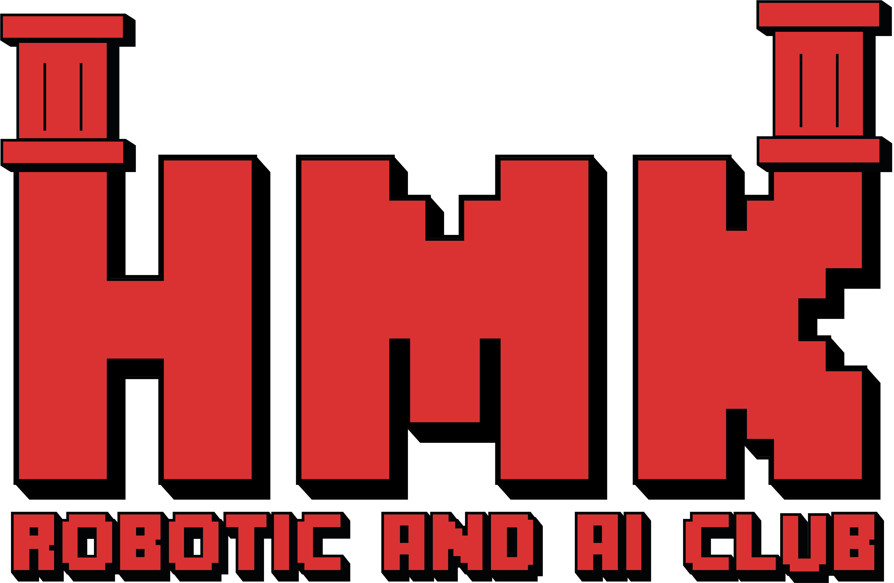

Welcome to the **FMEE 2025 Repository**, a showcase of **21 innovative robotics, AI, and interactive engineering projects** presented at the **Opening Event of the AI & Robotics Club**.

This collection represents the creativity and technical excellence of our students, combining hardware, software, AI, electronics, mechanics, game design, and interactive experiences.

---

## 🏆 About the Repository

**FMEE 2025 – AI & Robotics Club Opening Projects**  
This repository is a unified archive of all robotics, AI, automation, and interactive technology projects created for the 2025 exhibition and club launch.

Showcasing excellence in:

- 🤖 Robotics
- 🔧 Electronics
- 🎮 Game Development
- 🧠 AI & Computer Vision
- 💡 Interactive Experiences
- 🛠 Mechanical Design

It serves as:  
 ✔️ A portfolio for contributors  
 ✔️ A reference for future students  
 ✔️ A technical archive for the club  
 ✔️ A public showcase of innovation

---

# 📚 Table of Contents (21 Projects)

1. [Waving Robot](#Waving) 
2. [Game Scoring System]()  
3. [Tic-Tac-Toe]()   
4. [Path Puzzle ]() 
5. [Turtulisim Robot]() 
6. [Drawing Robot]()  
7. [Mystery Call Box]() 
8. [Memory Test]()  
9. [Klotski Puzzle]()  
10. [Joystick-Controlled Arm]()  
11. [4 Wins ]() 
12. [Drone Simulator]()  
13. [Drones  ]() 
14. [Eye Tracking System  ]()
15. [QuadSpider Robot]()  
16. [Squid Game Light-Challenge]() 
17. [Mecanum Wheels Robot]()  
18. [Rock–Paper–Scissors]()  
19. [Run Game]()  
20. [Hamek Feud]()  
21. [Super Hamaki Bros]()  

---

# 🔍 Project Summaries 

Below is a full list of all projects with brief descriptions and team member credits.  

## 🔴 1. Waving Robot  

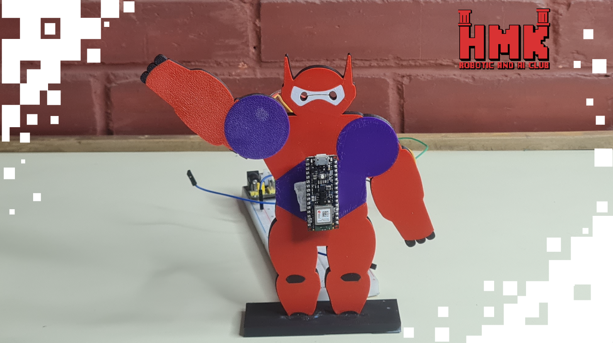

A robot that detects approaching visitors and waves automatically using Arduino Nano BLE Sense Rev2 and a servo mechanism.  

### **Technologies**
- Arduino Nano BLE Sense Rev2  
- Servo motors  
- Arduino IDE  
- 3D-printed structure  

### **Features**
- Autonomous detection  
- Smooth waving motion  
- Ideal for exhibitions
  
### **Contributors:**
- **Ayman Bakleh** [LinkedIn](https://www.linkedin.com/in/aymanbakleh/)

### **Project Description :**

👉 [Waving Robot README](https://github.com/Microbots-Team/Waving-Robots/)

---

## 🔴 2. Game Scoring System  
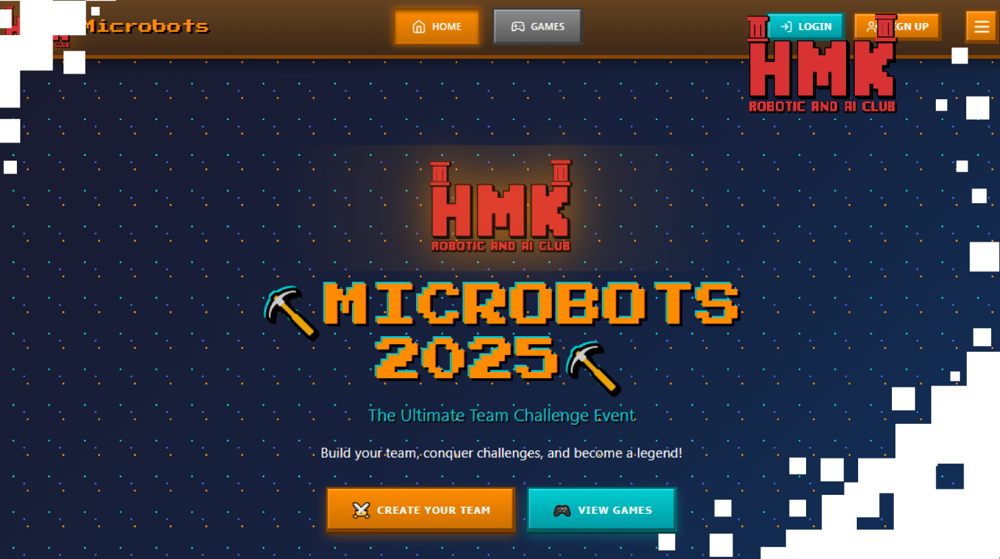
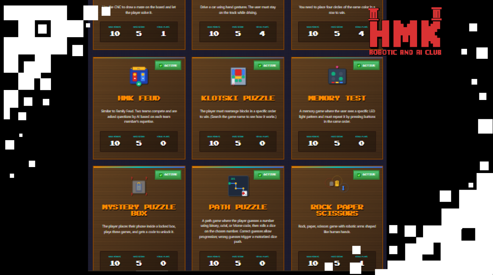
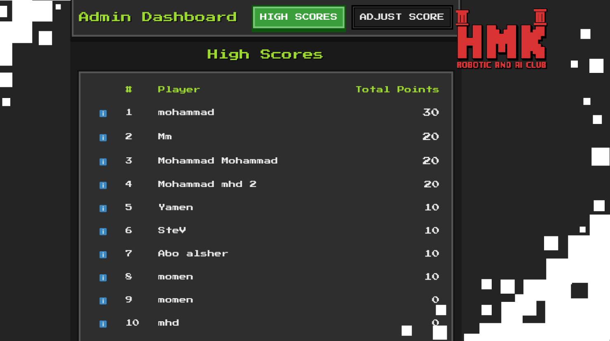

QR-based visitor login, score tracking across games, and live leaderboard system.  

### **Technologies**
- React.js (UI)  
- Django (Backend)  
- MongoDB  
- QR Code login  

### **Features**
- Live leaderboard  
- Admin dashboard  
- Visitor profile page  
- QR-based entry  
  
### **Contributors:** 
- **Mohammad Mohammad** [LinkedIn](https://www.linkedin.com/in/mohammad-mohammad-93917a252/)
- **Momen Defdaa** [LinkedIn](https://www.linkedin.com/in/momen-defdaa-0a18a0258)

### **Project Description :**
👉 [Game Scoring System README](https://github.com/Microbots-Team/Game-Scoring-System)

---

## 🔴 3. Tic-Tac-Toe 

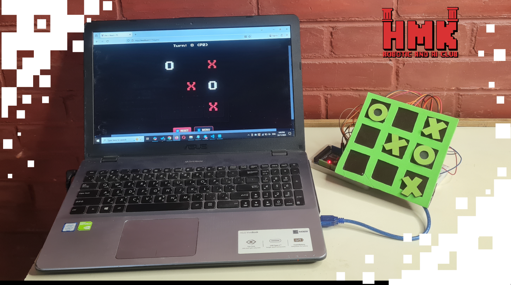

it is an interactive physical Tic-Tac-Toe (XO) game that allows a player to compete against the computer on a real-world game board. 

### **Technologies**
- Arduino Mega  
- Hall sensors  
- Magnetic pieces  
- Flask backend  
- React interface  

### **Features**
- Computer opponent  
- Real-time data processing  

### **Contributors:** 
- **Aya ALbadawe** [LinkedIn](https://www.linkedin.com/in/aya-albadawe-428a9938a)
- **Bayan Jafar**  [LinkedIn](https://www.linkedin.com/in/bayan-jafar-09aa9b24a)

### **Project Description :**
👉 [Tic-Tac-Toe README](https://github.com/Microbots-Team/Tic-Tac-Toe)

---

## 🔴 4. Path Puzzle  

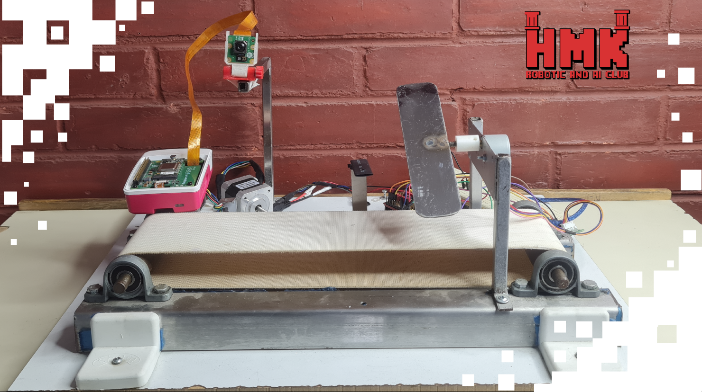

**Binary Dice Puzzle** - An interactive puzzle where visitors are shown a binary number and must convert it to decimal using a physical dice.  
The system validates their answer using AI-powered dice detection.

### **Technologies**
- Raspberry Pi 5  
- Raspberry Pi AI Kit (Hailo-8L)  
- YOLOv6  
- Python  
- OpenCV  

### **Features**
- Binary-to-decimal challenge  
- Real-time dice detection  
- Conveyor control logic  
- Correct/incorrect answer validation  

  
### **Contributors**

- **Ayman Bakleh** [LinkedIn](https://www.linkedin.com/in/aymanbakleh/)

### **Project Description :**

👉 [Project README](https://github.com/Microbots-Team/Path-Puzzle/)

---

## 🔴 5. Turtulisim Robot 

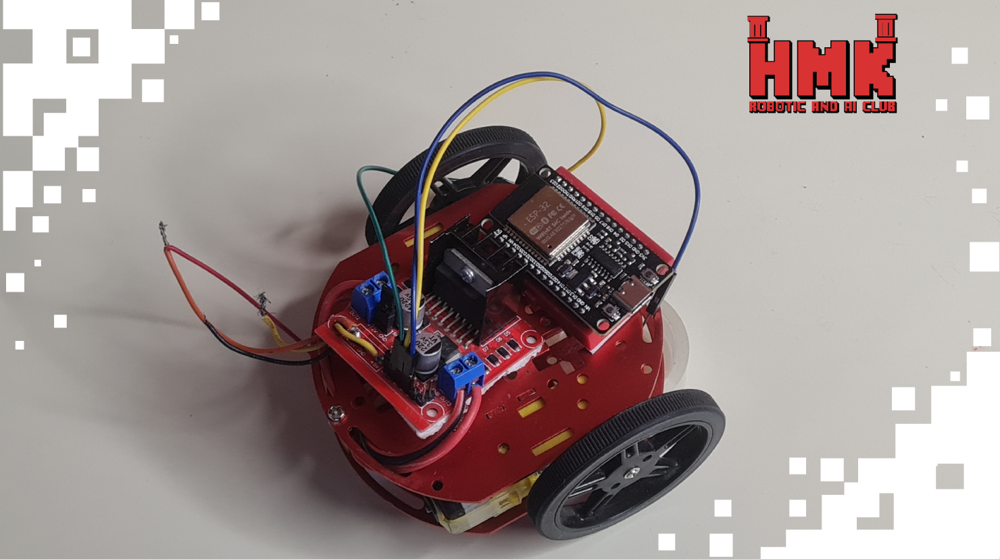

A robot designed in simulation environments and implemented physically for path following or behavior testing.  

### **Technologies**
- ROS  
- TurtleSim  
- ESP32  
- Motor drivers  
- Laptop Camera
- Mediapipe 

### **Features**
- Simulation-based control  
- ROS integration  

### **Contributors**  

- **Ahmad Sheikh Daher** [LinkedIn](https://www.linkedin.com/in/ahmad-sheikh-daher/)  
- **May Homsi** [LinkedIn](https://www.linkedin.com/in/may-homsi-04764335b/)  
- **Izzat Kawadri** [LinkedIn](https://www.linkedin.com/in/izzat-kawadri/)

### **Project Description :**
👉 [Project README](https://github.com/Microbots-Team/Turtulisim-Robot/)

---

## 🔴 6. Drawing Robot 

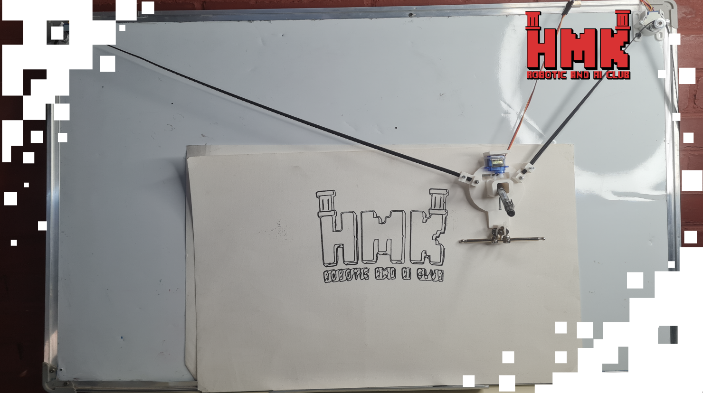

A small-scale CNC machine that draws or paints based on programmed paths.  

### **Technologies**
- CNC plotter  
- Stepper motors  
- GRBL firmware  
- G-code interpreter  

### **Features**
- Draws images  
- High precision motion  

### **Contributors**
- **Sulaiman Sulaiman** [LinkedIn](https://www.linkedin.com/in/sulaiman-sulaiman-98355238a)  

### **Project Description :**
👉 [Project README](https://github.com/Microbots-Team/Drawing-Robot)

---

## 🔴 7. Mystery Call Box 

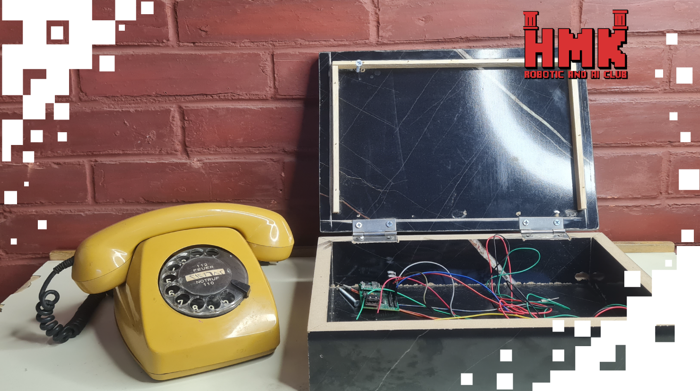

A retro-inspired interactive puzzle where placing a phone inside a box triggers an automatic lock. A vintage 1970s telephone beside the box begins to ring, delivering mysterious audio clues and mini-challenges. By solving these challenges, the user uncovers the secret code needed to unlock the box.

### **Technologies**

- Dual ESP32 microcontrollers  
- MP3 player module for audio clues  
- Servo-based locking mechanism  
- Vintage telephone interface  

### **Features**

- Audio-based puzzle clues  
- Real-time phone ringing and playback  
- Code verification to unlock the box  
- Immersive retro storytelling experience

### **Contributors**  

- **Ayman Bakleh** [LinkedIn](https://www.linkedin.com/in/aymanbakleh/)

### **Project Description :**
👉 [Project README](https://github.com/Microbots-Team/Mystery-Call-Box/)

---

## 🔴 8. Memory Test  

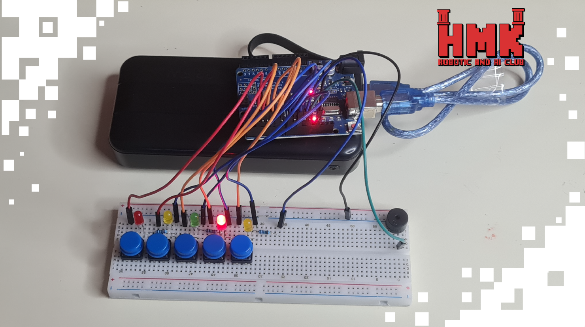

LED sequence memory game using push buttons and Arduino.  

### **Technologies**
- Arduino Uno  
- LEDs  
- Push buttons  
- Random game logic  

### **Features**
- Difficulty progression  
- Immediate feedback  

### **Contributors**  

- **Malek Shammout** [LinkedIn](https://www.linkedin.com/in/malek-shammout-090523337/)  

### **Project Description :**
👉 [Project README](https://github.com/Microbots-Team/Memory-Test/)

---

## 🔴 9. Klotski Puzzle  

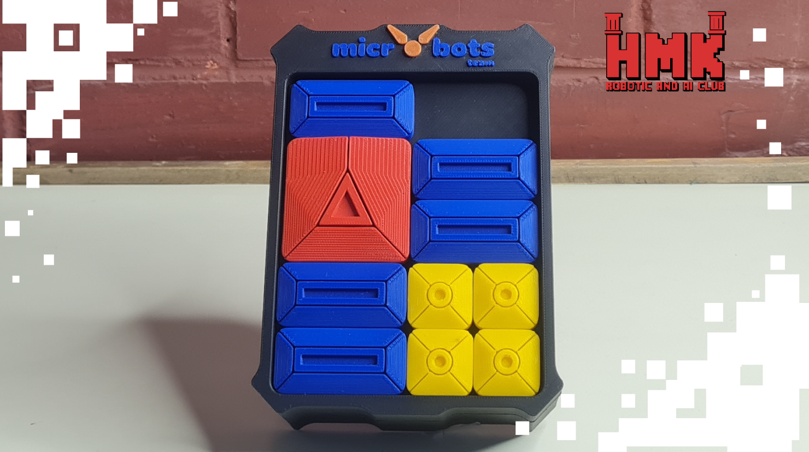

RFID-enabled interactive block puzzle verifying correct piece placement.  

### **Technologies**
- Arduino Uno  
- RFID reader  
- RFID-tagged puzzle pieces  

### **Features**
- Intelligent puzzle checking  
- Win detection  

### **Contributors**

- **Malek Shammout** [LinkedIn](https://www.linkedin.com/in/malek-shammout-090523337/)  

### **Project Description :**
👉 [Project README](https://github.com/Microbots-Team/Klotski-Block-Puzzle/)

---

## 🔴 10. Joystick-Controlled Robotic Arm  

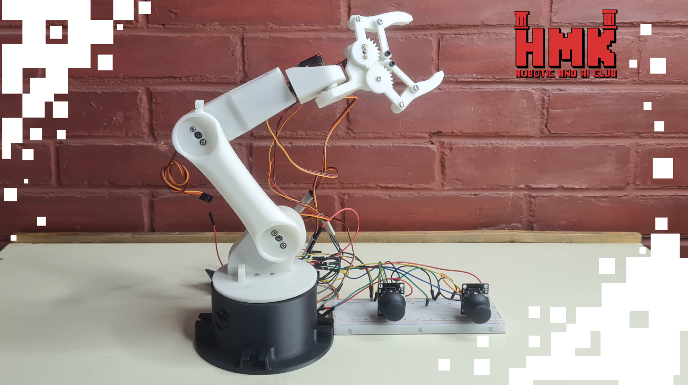

A simple and intuitive robotic arm controlled using two Arduino joysticks.

### **Technologies**

- Arduino Uno – main controller
- Servo motors – 4 high-precision servos for arm and gripper
- Analog joysticks – dual manual control for intuitive operation
- Servo controller / power module – stable servo power supply

### **Features**

- 4 DOF robotic arm (base rotation + 2 joints + gripper)
- Real-time joystick control
- Smooth and precise movement
- Beginner-friendly and modular design for easy upgrades
   

### **Contributors**

- **Ayman Bakleh** [LinkedIn](https://www.linkedin.com/in/aymanbakleh/)

### **Project Description :**
👉 [Project README](https://github.com/Microbots-Team/Joystick-Controlled-Robotic-Arm/)

---

## 🔴 11. 4 Wins  

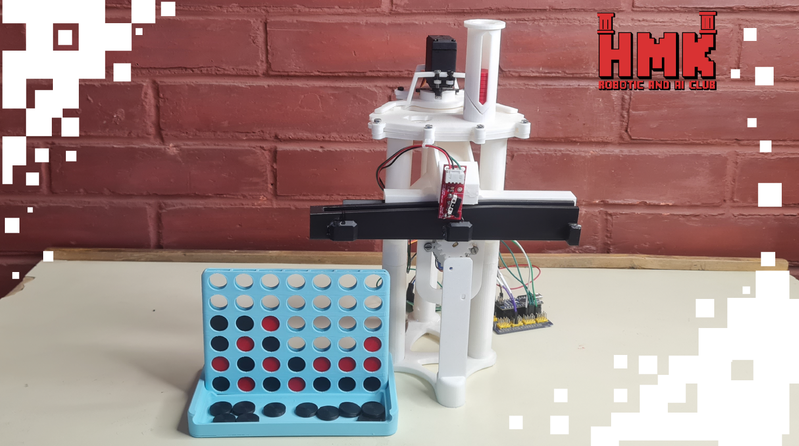

A digital or physical “Connect 4” style interactive game system.  

### **Technologies**
- Compter Vision for piece detection  
- Arduino Control 

### **Features**
- Real-time board state  
- Automated win checking  

### **Contributors**

- **Jolian Wassof** [LinkedIn](https://www.linkedin.com/in/jolian-wassof-85512b375/)  

### **Project Description :**
👉 [Project README](https://github.com/Microbots-Team/Four-Wins---Connect-Four-Robot)

---

## 🔴 12. Drone Simulator  

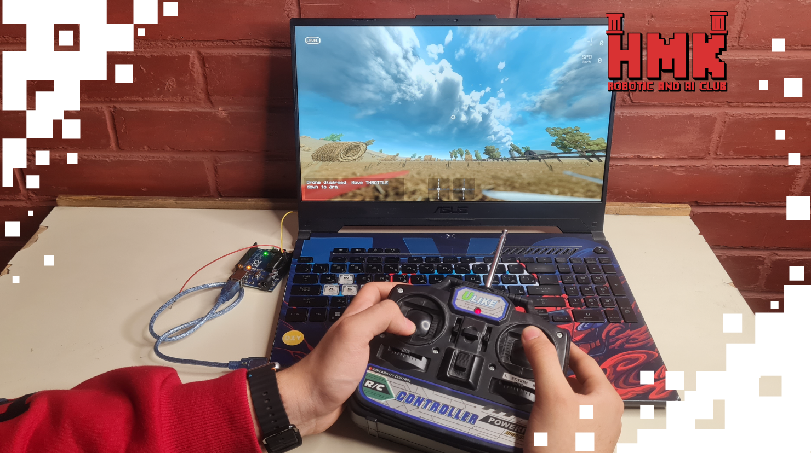

Drone training and flight environment using the Liftoff simulation platform.  

### **Technologies**
- Arduino Uno  
- FlySky Radio Controller & Receiver  
- PWM Signal Processing  
- Serial-to-Game Input Mapping 

### **Features**
- Real-controller integration with Liftoff  
- Smooth PWM-to-joystick translation  
- Low-latency input response  
- Expandable for multi-channel drone practice  

### **Contributors**

- **Jolian Wassof** [LinkedIn](https://www.linkedin.com/in/jolian-wassof-85512b375/)  
- **Malek Shammout** [LinkedIn](https://www.linkedin.com/in/malek-shammout-090523337/)  

### **Project Description :**
👉 [Project README](https://github.com/Microbots-Team/Drone-Simulator/)

---

## 🔴 13. Drones  

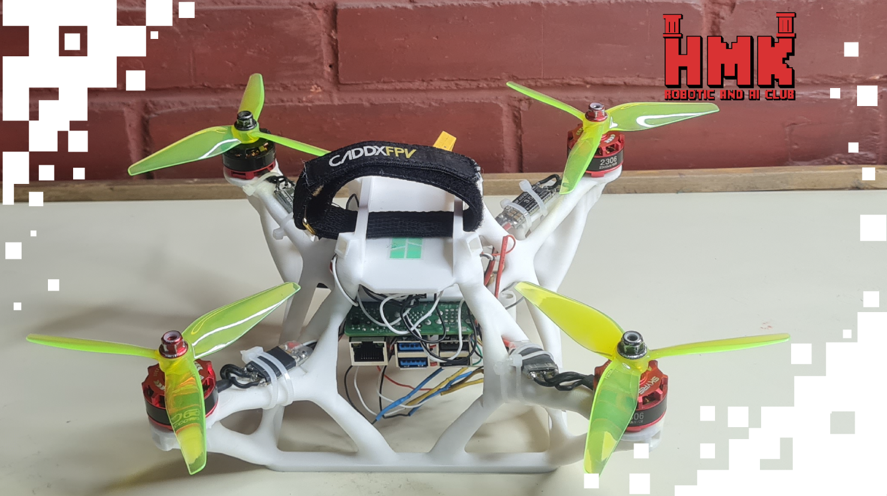

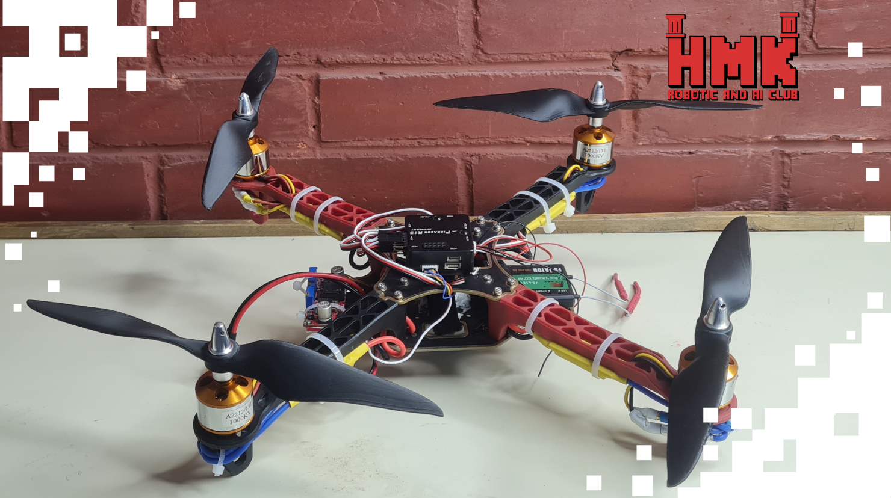
Hardware-built drones designed, assembled, and tested by the team.  

### **Technologies**
- Brushless motors  
- Pixhawk or Naza controller  
- ESCs  
- FPV (optional)  

### **Features**
- Manual & autonomous flight  
- Stable control  

### **Contributors**

- **Jolian Wassof** [LinkedIn](https://www.linkedin.com/in/jolian-wassof-85512b375/)  

### **Project Description :**
👉 [Project README](https://github.com/Microbots-Team/Drones/)

---

## 🔴 14. Eye Tracking  

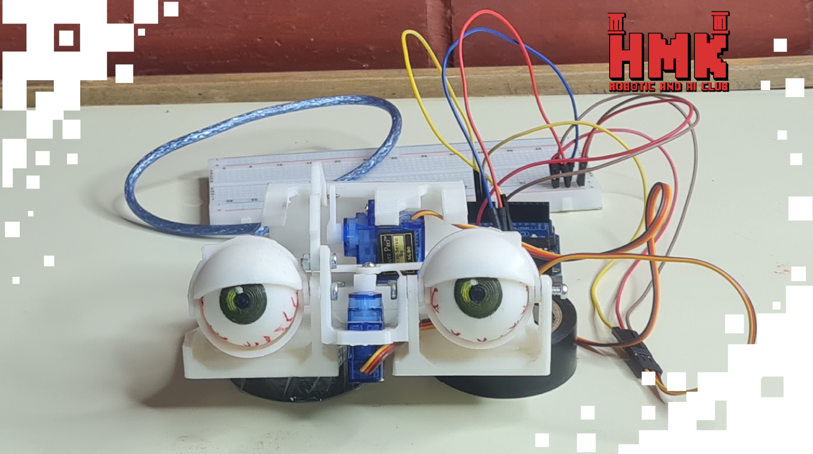

A system that detects and follows eye movement for control, accessibility, or interaction.  

### **Technologies**
- Python  
- OpenCV 
- Mediapipe 

### **Features**
- Real-time gaze mapping  
- Blink tracking  

### **Contributors**
- **Yasser Al-Sirafi** [LinkedIn](https://www.linkedin.com/in/yasser-al-sirafi-401437392/)
  
### **Project Description :**
👉 [Project README](https://github.com/Microbots-Team/Interactive-Eye-Tracker/)

---

## 🔴 15. QuadSpider Robot 

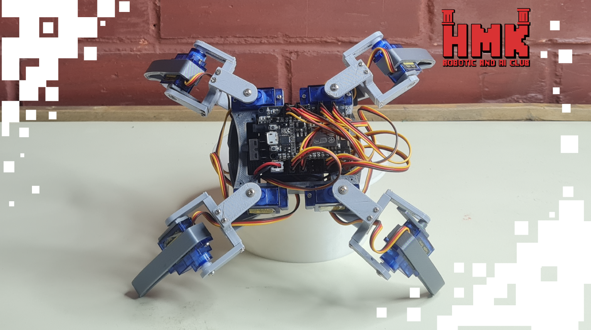

A mobile four-legged robot powered by ESP32 and controlled through a custom mobile app.  

### **Technologies**

- ESP32 (Wi-Fi-enabled microcontroller)
- Servo motors (dual-servo mechanism per leg)
- Mobile app control (real-time commands + special actions)
- Arduino IDE (programming environment)
- Wi-Fi communication (ESP32 networking for wireless control)

### **Features**
- 4-legged robot with 8 servo-driven joints
- Real-time mobile control (movement, turning, sequencing)
- Preset motion routines (dance / pattern sequences)
- Stable, coordinated multi-servo movement

### **Contributors**

- **Ahmad Sheikh Daher** [LinkedIn](https://www.linkedin.com/in/ahmad-sheikh-daher/)  

### **Project Description :**
👉 [Project README](https://github.com/Microbots-Team/QuadSpider-Robot/)

---

## 🔴 16. Squid-Game 🟢🔴 Light-Challenge  

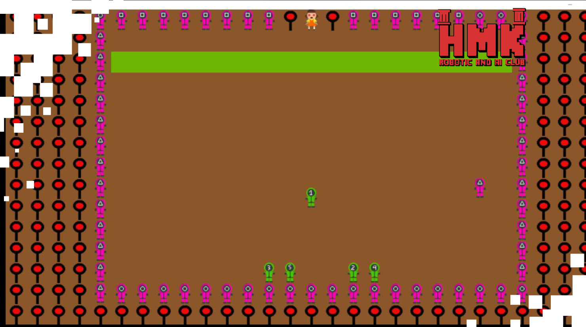

A set of game challenges inspired by the popular series, implemented with sensors, robotics, or motion tracking.  

### **Technologies**

- GDevelop – game logic, animations, and red/green light system
- Arduino – hardware interface for button-based player input
- Serial Communication – real-time link between Arduino and the game
- Push-Button Controls – physical input system for four players

### **Features**

- 4-player physical controller using individual push buttons
- Real-time red/green light reaction system
- Hybrid gameplay combining digital racing with real hardware
- Penalty and elimination logic for red-light movement
- Scalable design for adding more players or rules

### **Contributors**

- **Mouayad bakleh** [LinkedIn](https://www.linkedin.com/in/moaiad-bakleh-4459a3376)

### **Project Description :**
👉 [Project README](https://github.com/Microbots-Team/Squid-Game-Light-Challenge)

---

## 🔴 17. Mecanum Wheels Robot 

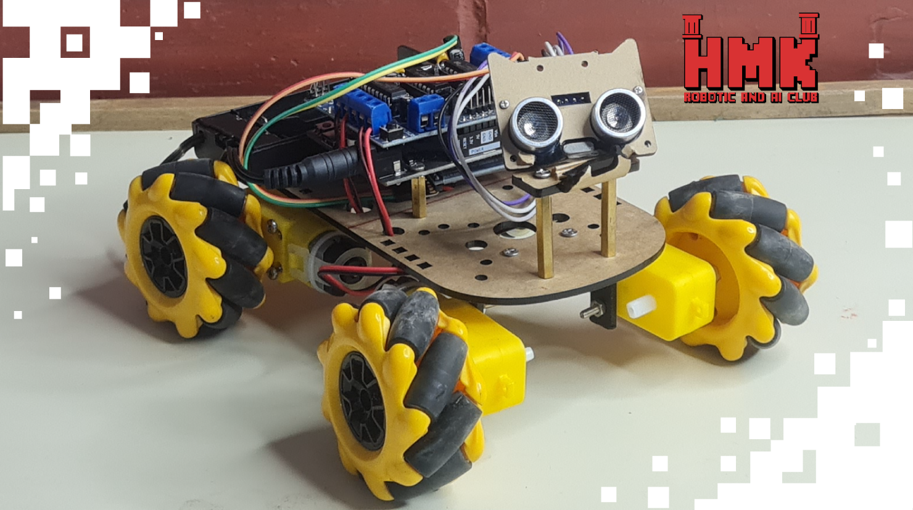

A robot with omni-wheels allowing full 360° movement in any direction.  

### **Technologies**

- ESP32 – wireless communication and motor control
- DC Motors + Motor Driver – independent wheel control
- Mecanum Wheel System – omnidirectional mobility
- Ultrasonic Sensor – basic obstacle detection
- Mobile App Control – real-time user commands

### **Features**

- Full omnidirectional movement (forward, sideways, diagonal, rotation)
- Mobile app driving interface
- Smooth multi-motor coordination
- Obstacle detection using ultrasonic sensor
- Expandable design for future sensors or autonomy

### **Contributors**

- **Ahmad Sheikh Daher** [LinkedIn](https://www.linkedin.com/in/ahmad-sheikh-daher/)  

### **Project Description :**
👉 [Project README](https://github.com/Microbots-Team/Mecanum-Wheels-Robot/)

---

## 🔴 18. Rock–Paper–Scissors Bot  

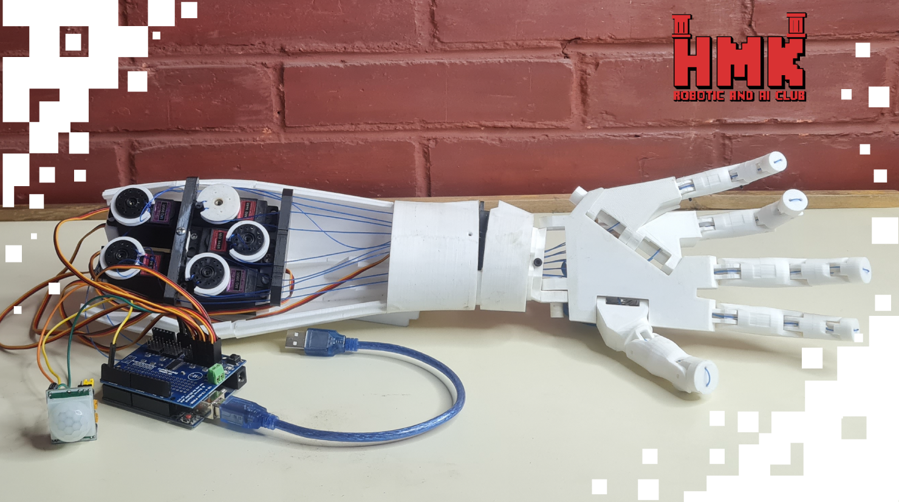

a dual-mode Rock-Paper-Scissors robot that combines basic sensor interaction with advanced motion-tracking.  

### **Technologies**

- Raspberry Pi – handles image processing 
- Arduino – servo control and game logic execution
- Servo Motors – robotic hand movement
- Leap Motion Controller – advanced 3D hand-gesture detection
- PIR Motion Sensor – simple mode trigger for random actions
- Python / Leap SDK – gesture interpretation and communication

### **Features**

- Two interaction modes: simple (PIR) & advanced (Leap Motion)
- Real-time gesture recognition
- Smooth and responsive robotic gestures
- Hybrid design showcasing both basic and modern sensing
- Expandable for AI strategy or enhanced gameplay

### **Contributors**

- **Shahd Alkhawam** [LinkedIn](https://www.linkedin.com/in/shahd-alkhawam-1b98a6373/)
 
- **Ayman Bakleh** [LinkedIn](https://www.linkedin.com/in/aymanbakleh/)

### **Project Description :**
👉 [Project README](https://github.com/Microbots-Team/Rock-Paper-Scissors/)

---

## 🔴 19. Run  

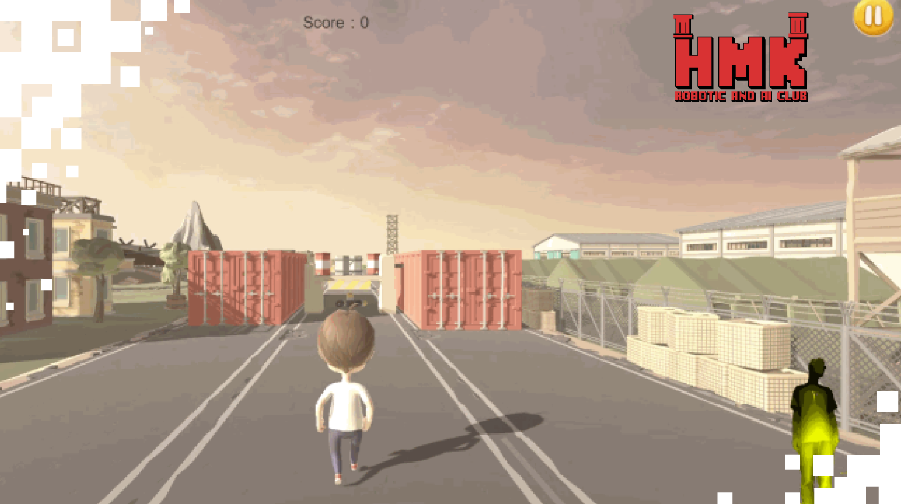

it is a full-body 3D running game where players control the character entirely through physical movement using an Xbox Kinect camera.

### **Technologies**

- Xbox Kinect – skeletal tracking and body-movement detection
- Unity Engine – 3D game development and motion-based control integration
- C# Scripting – gameplay logic and Kinect input handling
- Kinect SDK – real-time body-tracking data

### **Features**

- Full-body motion control (lean, jump)
- Endless-runner gameplay with dynamic movement responsiveness
- Immersive physical interaction—your body is the controller
- Modular design for adding new levels, obstacles, and animations

### **Contributors**

- **Aziz Marashly** [LinkedIn](https://www.linkedin.com/in/azizmarashly/)
- **Izzat Kawadri** [LinkedIn](https://www.linkedin.com/in/izzat-kawadri/)

### **Project Description :**
👉 [Project README](https://github.com/Microbots-Team/Run/)

---

## 🔴 20. Hamek Feud  

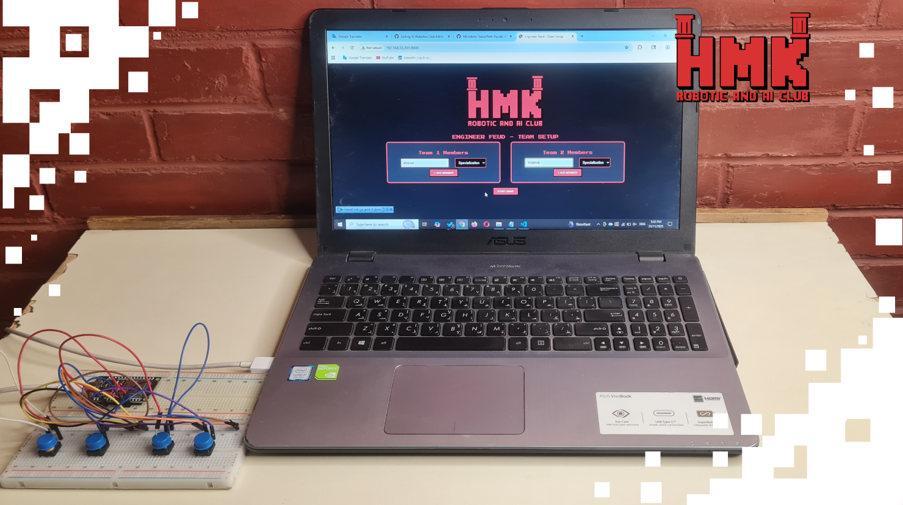

A family-feud style quiz game with scoring, buttons, and interactive displays.  

### **Technologies**
- Web interface  
- Arduino buzzer system  
- Real-time scoring  

### **Features**
- Multiplayer  
- Live questions  

### **Contributors**

- **Abdulhadi Albitar** — [LinkedIn](https://www.linkedin.com/in/abdulhadi-albitar-020893241/)
- **Rosah Alnammour** — [LinkedIn](https://www.linkedin.com/in/rosah-alnammour/)
- **Izzat Kawadri** [LinkedIn](https://www.linkedin.com/in/izzat-kawadri/)

### **Project Description :**
👉 [Project README](https://github.com/Microbots-Team/Hamk-Feud/)

---

## 🔴 21. Super Hamaki Bros  

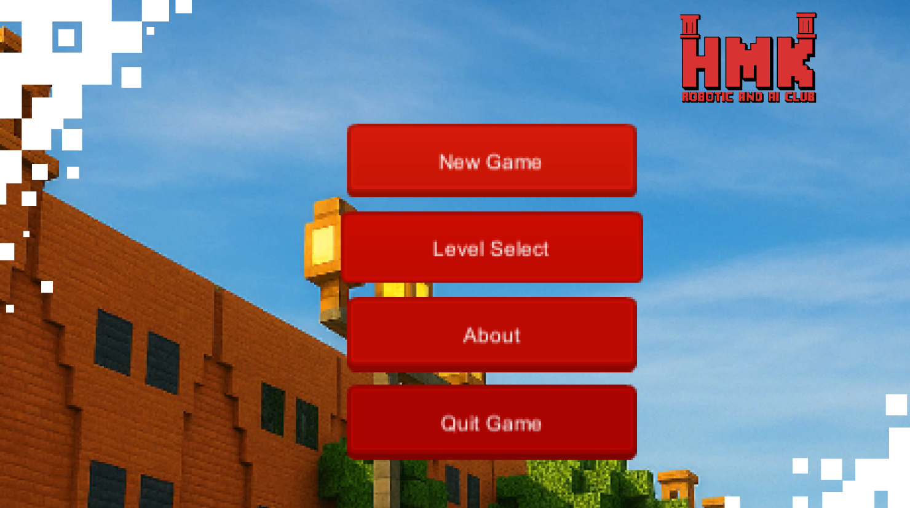

A fun interactive platformer game inspired by classic arcade mechanics.  

### **Technologies**
- Unity  
- Pixel art   
- Physics-based movement  

### **Features**
- Custom levels  
- Boss battles  

### **Contributors**

- **Izzat Kawadri** [LinkedIn](https://www.linkedin.com/in/izzat-kawadri/)

### **Project Description :**
👉 [Project README](https://github.com/Microbots-Team/Super-Hamki-Bros/)

---

# 🎉 Special Thanks & Credits

A huge thank you to everyone who made **FMEE 2025** and the **AI & Robotics Club Opening Event** a success.

### 🧑‍🏫 Organizers

- **Dr. Sami Al-Issa – Event Supervisor**
🔗 [LinkedIn](https://www.linkedin.com/in/sami-al-issa-a7871a129/)

- **Eng. Ayman Bakleh – Robotics Club Coordinator**   🔗 [LinkedIn](https://www.linkedin.com/in/aymanbakleh/)  

### 📜 Documentation
- **Eng. Izzat Kawadri - Projects Manager** 🔗 [LinkedIn](https://www.linkedin.com/in/izzat-kawadri/)

### 📸 Media Team 
- **Malek Shammout – Photography & Media Leader**  🔗 [LinkedIn](https://www.linkedin.com/in/malek-shammout-090523337/)  
   
- **Shahd Alkhawam – Social Media & Branding**  🔗 [LinkedIn](https://www.linkedin.com/in/shahd-alkhawam-1b98a6373/)

- **Sarah Alahmad – Social Media & Branding** 🔗 [LinkedIn](https://www.linkedin.com/in/sarah-alahmad-bb23271b7/)

- **Tasnem Kanakriah – Social Media & Branding** 🔗 [LinkedIn](https://www.linkedin.com/in/tasnem-kanakriah/)

### 📸 Projects Team

- **Eng. Ayman Bakleh** [LinkedIn](https://www.linkedin.com/in/aymanbakleh/)
- **Eng. Aziz Marashly** [LinkedIn](https://www.linkedin.com/in/azizmarashly/)
- **Aya ALbadawe** [LinkedIn](https://www.linkedin.com/in/aya-albadawe-428a9938a)
- **Bayan Jafar**  [LinkedIn](https://www.linkedin.com/in/bayan-jafar-09aa9b24a)
- **Mohammad Mohammad** [LinkedIn](https://www.linkedin.com/in/mohammad-mohammad-93917a252/)
- **Momen Defdaa** [LinkedIn](https://www.linkedin.com/in/momen-defdaa-0a18a0258)
- **Ahmad Sheikh Daher** [LinkedIn](https://www.linkedin.com/in/ahmad-sheikh-daher/)
- **Malek Shammout** [LinkedIn](https://www.linkedin.com/in/malek-shammout-090523337/)  
- **May Homsi** [LinkedIn](https://www.linkedin.com/in/may-homsi-04764335b/)
- **Sulaiman Sulaiman** [LinkedIn](https://www.linkedin.com/in/sulaiman-sulaiman-98355238a)
- **Shahd Alkhawam** [LinkedIn](https://www.linkedin.com/in/shahd-alkhawam-1b98a6373/)
- **Jolian Wassof** [LinkedIn](https://www.linkedin.com/in/jolian-wassof-85512b375/)
- **Yasser Al-Sirafi** [LinkedIn](https://www.linkedin.com/in/yasser-al-sirafi-401437392/)
- **Mouayad bakleh** [LinkedIn](https://www.linkedin.com/in/moaiad-bakleh-4459a3376)
- **Abdulhadi Albitar** — [LinkedIn](https://www.linkedin.com/in/abdulhadi-albitar-020893241/)
- **Eng. Rosah Alnammour** — [LinkedIn](https://www.linkedin.com/in/rosah-alnammour/)
- **Eng. Izzat Kawadri** [LinkedIn](https://www.linkedin.com/in/izzat-kawadri/)

Your support, creativity, and hard work made this exhibition truly exceptional.

---

# 📜 License
All projects are published under the **MIT License**, unless a project folder specifies otherwise.

---

### ✨ Built with passion by the FMEE Students, 2025  
### 🤖 Proudly presented by the AI & Robotics Club  
